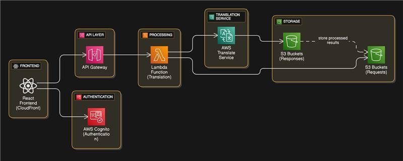

# AWS Translate Application

**Live Application:** [AWS Translate Service Application](https://d3w27mxar4i1fe.cloudfront.net/)

A comprehensive serverless translation application built with AWS services, featuring a React frontend, Lambda-powered translation API, and complete CI/CD pipeline using Terraform and GitHub Actions.

## Architecture

### Architecture Overview

This project implements a fully serverless architecture leveraging multiple AWS services for optimal scalability and cost-effectiveness:

```
┌─────────────────┐    ┌──────────────────┐    ┌─────────────────┐
│   React Frontend│    │   API Gateway    │    │  Lambda Function│
│   (CloudFront)  │───▶│                  │───▶│  (Translation)  │
│                 │    │                  │    │                 │
└─────────────────┘    └──────────────────┘    └─────────────────┘
         │                                                │
         │                                                ▼
         │              ┌──────────────────┐    ┌─────────────────┐
         │              │   AWS Cognito    │    │  AWS Translate  │
         └─────────────▶│  (Authentication)│    │     Service     │
                        │                  │    │                 │
                        └──────────────────┘    └─────────────────┘
                                                          │
                                                          ▼
                        ┌──────────────────┐    ┌─────────────────┐
                        │   S3 Buckets     │    │   S3 Buckets    │
                        │  (Requests)      │◀───│  (Responses)    │
                        │                  │    │                 │
                        └──────────────────┘    └─────────────────┘
```


### Visual Architecture Diagram



**Key Components:**
- **Frontend**: React application distributed via CloudFront CDN
- **API Gateway**: RESTful API endpoint management and routing
- **Lambda Functions**: Serverless compute for translation logic
- **AWS Translate**: Machine learning translation service
- **Cognito**: User authentication and authorization
- **S3**: Storage for translation requests and responses
- **Infrastructure as Code**: Terraform for resource management
- **CI/CD**: GitHub Actions for automated deployment

## Project Structure

```
aws-translate-app/
├── .github/
│   └── workflows/
│       └── deploy.yml                 # GitHub Actions CI/CD pipeline
├── architecture-diagram/
│   └── diagram.png                    # Visual architecture diagram
├── infrastructure/
│   ├── main.tf                        # Main Terraform configuration
│   ├── variables.tf                   # Terraform variables
│   ├── outputs.tf                     # Terraform outputs
│   └── backend.tf                     # Remote state configuration
├── lambda/
│   ├── translate_function.py          # Lambda function code
│   ├── requirements.txt               # Python dependencies
│   └── lambda_deployment.zip          # Deployment package (auto-generated)
├── frontend/
│   ├── public/
│   │   └── index.html                 # HTML template
│   ├── src/
│   │   ├── components/
│   │   │   ├── TranslationForm.js     # Upload and translation component
│   │   │   └── AuthComponent.js       # Authentication component
│   │   ├── App.js                     # Main React application
│   │   ├── index.js                   # React entry point
│   │   ├── aws-config.js              # AWS configuration
│   │   └── index.css                  # Styling
│   ├── package.json                   # Node.js dependencies
│   └── build/                         # Built React app (auto-generated)
├── sample-files/
│   └── sample-translation.json        # Example translation request
├── README.md                          # Project documentation
└── .gitignore                         # Git ignore file
```

## Getting Started

### Prerequisites

Before you begin, ensure you have the following installed and configured:

- **AWS Account** with CLI configured
- **GitHub Account** for repository and Actions
- **Node.js** (version 14 or later)
- **Terraform** (version 1.0 or later)
- **Python 3.9** or later

### Initial Setup

#### 1. Create Terraform Backend

First, create an S3 bucket for storing Terraform state:

```bash
aws s3 mb s3://your-terraform-state-bucket-unique-name
aws s3api put-bucket-versioning \
  --bucket your-terraform-state-bucket-unique-name \
  --versioning-configuration Status=Enabled
```

#### 2. Clone and Configure Project

```bash
git clone <your-repo-url>
cd aws-translate-app
```

Update `infrastructure/backend.tf` with your actual bucket name:

```hcl
terraform {
  backend "s3" {
    bucket = "your-terraform-state-bucket-unique-name"
    key    = "terraform.tfstate"
    region = "us-east-1"
  }
}
```

#### 3. Configure GitHub Secrets

Navigate to your GitHub repository settings and add the following secrets:

| Secret Name | Description | Example |
|-------------|-------------|---------|
| `AWS_ACCESS_KEY_ID` | Your AWS access key | `AKIA...` |
| `AWS_SECRET_ACCESS_KEY` | Your AWS secret key | `wJalr...` |
| `AWS_REGION` | Deployment region | `us-east-1` |
| `TF_STATE_BUCKET` | Terraform state bucket | `your-bucket-name` |

#### 4. Deploy Infrastructure

Push your changes to GitHub. The automated pipeline will:

1. **Infrastructure Deployment**: Terraform creates all AWS resources
2. **Lambda Deployment**: Python function is packaged and deployed
3. **Frontend Deployment**: React application is built and distributed

Monitor deployment progress in the **Actions** tab of your GitHub repository.

#### 5. Access Your Application

After successful deployment, find your application URL in the GitHub Actions output or Terraform outputs.

## Local Development

### Infrastructure Development

```bash
cd infrastructure
terraform init
terraform plan
terraform apply
```

### Frontend Development

```bash
cd frontend
npm install
npm start
```

The development server will start on `http://localhost:3000`.

### Lambda Function Testing

```bash
cd lambda
pip install -r requirements.txt
python translate_function.py
```

## Application Usage

### Getting Started with Translation

1. **Access the Application**: Navigate to your deployed application URL
2. **User Authentication**: Create an account or sign in using Cognito
3. **Upload Translation Request**: Submit a JSON file with your translation requirements
4. **View Results**: Review translated content in the application interface

### Input Format

The application accepts JSON files with the following structure:

```json
{
  "source_language": "en",
  "target_language": "es",
  "texts": [
    "Hello, world!",
    "How are you today?",
    "This is a test translation."
  ]
}
```

**Supported Parameters:**
- `source_language`: Source language code (e.g., "en", "fr", "de")
- `target_language`: Target language code (e.g., "es", "ja", "zh")
- `texts`: Array of strings to translate

## Customization and Extension

### Adding Language Support

AWS Translate supports numerous language pairs. To add new languages:

1. Update the language dropdown options in `frontend/src/components/TranslationForm.js`
2. Refer to [AWS Translate Language Codes](https://docs.aws.amazon.com/translate/latest/dg/what-is-languages.html) for supported languages

### Enhancing Lambda Functionality

Extend the Lambda function in `lambda/translate_function.py` to support:

- **Batch Processing**: Handle multiple translation requests simultaneously
- **File Format Support**: Accept different input formats (CSV, TXT, DOCX)
- **Custom Terminology**: Implement domain-specific translation glossaries
- **Translation Confidence**: Return confidence scores for translations

### Frontend Enhancements

Customize the user interface by:

- Modifying styles in `frontend/src/index.css`
- Adding new React components for additional features
- Integrating AWS Amplify UI components for consistent design

## Troubleshooting

### Common Issues and Solutions

**Infrastructure Deployment Failures**
```bash
# Force unlock Terraform state if locked
terraform force-unlock <lock-id>

# Validate Terraform configuration
terraform validate
```

**Authentication Problems**
- Verify Cognito User Pool configuration in AWS Console
- Check AWS Amplify configuration in `frontend/src/aws-config.js`
- Ensure proper IAM permissions for Cognito integration

**API Gateway CORS Issues**
- Confirm CORS is enabled for all required HTTP methods
- Verify CloudFront distribution settings allow required headers
- Check API Gateway deployment stages

**Lambda Function Errors**
- Review CloudWatch Logs at `/aws/lambda/translate-function`
- Verify IAM execution role has required permissions for AWS Translate
- Check function timeout settings for large translation requests

### Monitoring and Logging

**Application Monitoring:**
- **Lambda Execution**: CloudWatch Logs → `/aws/lambda/translate-function`
- **API Gateway**: CloudWatch Logs → API Gateway execution logs
- **Frontend Issues**: Browser Developer Tools → Console tab

**Performance Metrics:**
- Monitor Lambda duration and memory usage in CloudWatch
- Track API Gateway request latency and error rates
- Review CloudFront cache hit rates and data transfer

## Cost Optimization

This application is designed to operate within AWS Free Tier limits:

| Service | Free Tier Limit | Usage Pattern |
|---------|----------------|---------------|
| AWS Translate | 2M characters/month (first 12 months) | On-demand translation |
| Lambda | 1M requests + 400K GB-seconds/month | Event-driven execution |
| S3 | 5 GB storage + request quotas | Document storage |
| CloudFront | 1 TB data transfer/month | Content delivery |
| Cognito | 50,000 Monthly Active Users | User authentication |

**Cost Management Tips:**
- Monitor usage through AWS Cost Explorer
- Set up billing alerts for cost thresholds
- Use S3 lifecycle policies for older translation data
- Consider Reserved Capacity for predictable workloads

## Security and Best Practices

**Security Measures Implemented:**
- **Least Privilege Access**: IAM roles with minimal required permissions
- **Encryption in Transit**: HTTPS enforced across all endpoints
- **Authentication**: Cognito-managed user authentication and session handling
- **Data Protection**: S3 bucket policies preventing unauthorized access
- **API Security**: API Gateway with authentication and rate limiting

**Best Practices:**
- Regular security updates for all dependencies
- Environment-specific configuration management
- Automated security scanning in CI/CD pipeline
- Regular access reviews and permission audits

## Additional Resources

- [AWS Translate Documentation](https://docs.aws.amazon.com/translate/)
- [Terraform AWS Provider Documentation](https://registry.terraform.io/providers/hashicorp/aws/latest/docs)
- [AWS Amplify UI Components](https://ui.docs.amplify.aws/)
- [GitHub Actions Workflow Syntax](https://docs.github.com/en/actions/using-workflows/workflow-syntax-for-github-actions)
- [AWS Well-Architected Framework](https://aws.amazon.com/architecture/well-architected/)

## Contributing

We welcome contributions to improve this project:

1. **Fork** the repository
2. **Create** a feature branch (`git checkout -b feature/amazing-feature`)
3. **Commit** your changes (`git commit -m 'Add amazing feature'`)
4. **Push** to the branch (`git push origin feature/amazing-feature`)
5. **Open** a Pull Request

